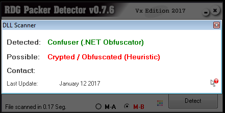
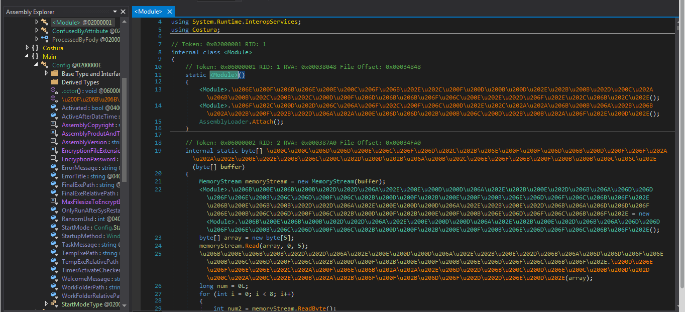
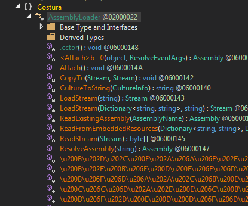
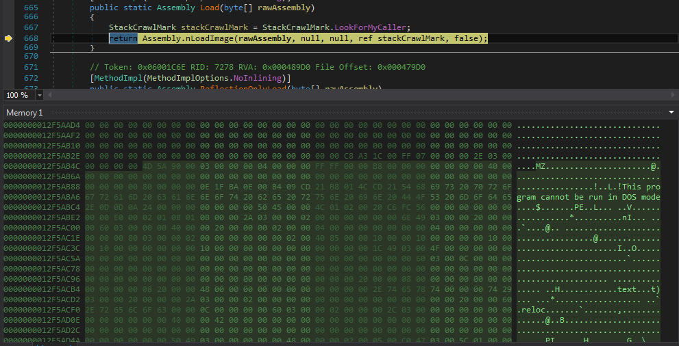
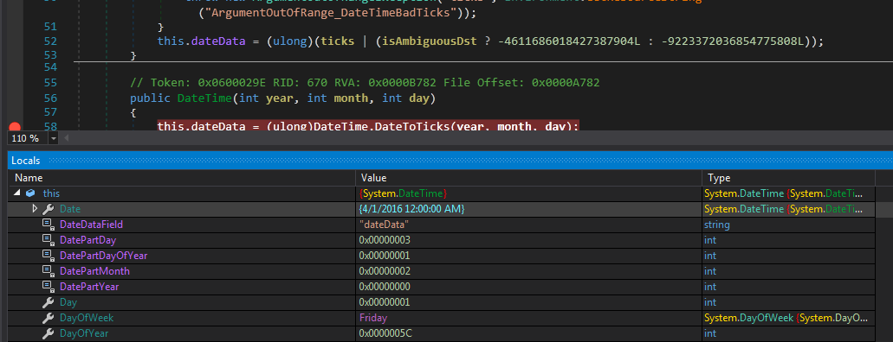
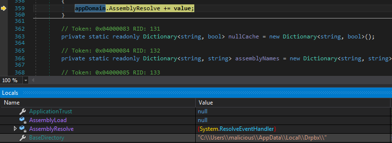
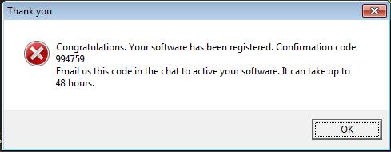

# **Basic Properties**:

|**Name:**|Jigsaw Ransomware|
|:-:|:-:|
|**SHA256:**|**3ae96f73d805e1d3995253db4d910300d8442ea603737a1428b613061e7f61e7**|
|**SHA-1**|**27d99fbca067f478bb91cdbcb92f13a828b00859**|
|**MD5**|**2773e3dc59472296cb0024ba7715a64e**|
|**File Type**|**64Bit .Net EXE**|

After performing initial static analysis we found out that the sample is a 64bit PE .net executable.


The malware is obfuscated using confuser. Confuser is one of the best open source .net obfuscator.




# **.Net Code Analysis**:

We can use a .Net decompiler or debugger to analyze the malware. In this case as the code is obfuscated using confuser therefore we will not get much information by looking at the source code.




# **Costura**:
Another interesting thing that we found was the use of Costura method, It is an add-in for Fody that enables to merge dependencies as embedded resources. It allows to embedded a DLL or any other code that is required by the bianry inside the resource section as a method.  




# **Load Image**:



The malware creates an image at runtime and that image is sent to the **currentDomain.AssemblyResolve**, This call will succeed in creating an instance of MyType since the assemby resolver is set.
The image contains the signature to that of a PE executable meaning that it might be some kind of resource that malware uses at runtime.


After manually dumping and analyzing the resource we found out that the image contains some important resources that the malware uses at runtime like the main pop up Image and the target extensions that the malware will encrypt.

The image is that of Billy the Puppet from the Saw, The malware will use that image at runtime to create a pop up at runtime.


The following extensions will be targeted by the malware and will be encrypted at runtime.

```
.jpg .jpeg .raw .tif .gif .png .bmp.3dm .max.accdb .db
.dbf .mdb .pdb .sql .dwg .dxf .c .cpp .cs .h .php .asp
.rb .java .jar .class .py .js.aaf .aep .aepx .plb .prel
.prproj .aet .ppj .psd .indd .indl .indt .indb .inx .xml
.idml .pmd .xqx .xqx .ai .eps .ps .svg .swf .fla .as3
.as.txt .doc .dot .docx .docm .dotx .dotm .docb .rtf .wpd
.wps .msg .pdf .xls .xlt .xlm .xlsx .xlsm .xltx .xltm .xlsb
.xla .xlam .xll .xlw .ppt .pot .pps .pptx .pptm .potx .potm
.ppam .ppsx .ppsm .sldx .sldm.wav .mp3 .aif .iff .m3u .m4u
.mid .mpa .wma .ra .avi .mov .mp4 .3gp .mpeg .3g2 .asf .asx
.flv .mpg .wmv .vob .m3u8.dat .csv .efx .sdf .vcf .ses.Qbw
.QBB .QBM .QBI .QBR  .Cnt .Des .v30 .Qbo .Ini .Lgb .Qwc .Qbp
.Aif .Qba .Tlg .Qbx .Qby  .1pa .Qpd .Txt .Set .Iif  .Nd .Rtp
.Tlg .Wav .Qsm .Qss .Qst .Fx0 .Fx1 .Mx0 .FPx .Fxr .Fim .ptb
.Ai .Pfb .Cgn .Vsd .Cdr .Cmx .Cpt .Csl .Cur .Des .Dsf .Ds4
.Drw .Dwg.Eps .Ps .Prn .Gif .Pcd .Pct .Pcx .Plt .Rif .Svg .Swf
.Tga .Tiff .Psp .Ttf .Wpd .Wpg .Wi .Raw .Wmf .Txt .Cal .Cpx
.Shw .Clk .Cdx .Cdt .Fpx .Fmv .Img .Gem .Xcf .Pic .Mac .Met
.PP4 .Pp5 .Ppf .Xls .Xlsx .Xlsm .Ppt .Nap .Pat .Ps .Prn
.Sct .Vsd .wk3 .wk4 .XPM .zip .rar
```


# **Initializing Date**:



the malware saves **01st April 2016**(4/1/2016) as date in the in dateData variable and then checks that date with the system date. If the system date is after after **1st April 2016** then the ransomware will start its execution otherwise it wont execute. Thus one way of not letting this malware execute is by setting the system date before **4/1/2016**.


# **Dropping Files**:

**The Ransomware Drops 2 files**:

## Drpbox.exe:



The malware creates a directory at **C/users/username/appdata/local** named drpbx and drops a copy of the malware at that location and names it **drpbx.exe**


## Firefox.exe:


The malware drops another copy of itself named **firefox.exe** at **C/users/username/appdata/local/Frfx**


# **Modifying Registry Key**:

The malware automatically runs every time the system is restarted, for doing this the malware creates a registry key.


The malware creates a key at:
“**HKEY_Current_User\\\Software\\\Microsoft\\\Windows\\\CurrentVersion\\\Run**”
Having name “**Firefox.exe**” and value “**C\\\users\\\username\\\appdata\\\local\\\Frfx\\\Firefox.exe**”
The Run keys cause programs to run each time that a user logs on.
and adds the value of **Firefox.exe** to it.


# **Forms Background**:

Firstly an error message is printed telling the user that the software is registered and gives a confirmtion code and tells the user to eamil this code to the software vendor to activate the software.


Then then it looks like the ransomware is activated and ransom message is printed out threatning user to delete the data if ransom is not payed in next 48 hours.


# **Ransom Message**:



When we run the ransomware first we get the error popup telling us that our software has been registered properly and we can expect it to get activated in next 48 hours.

After the congratulation pop up we get another which contains jigsaw as background along with the ransom threat that if we do not pay the ransom of $150 within the next 48 hour then the ransomware will delete all the files from user’s system. The ransomware decreases the timer if we restart our system.


There is an option in the ransom threat popup which allows us to view the list of encrypted files.


# **Encryption**:

The malware performs **AES**(Advanced Encryption Standard) Encryption to encrypt the files in the system. It uses the **CBC**(cipher block chaining) method of AES encryption.</br>
 **AES-CBC** mode is the most widely used symmetric encryption algorithm. After encryption the malware uses **.fun** extension at the end of the filename.


## Encryption Key:

We were able to extract the encryption key used by the ransomware, This is the 16 byte AES-CBC encryption key that was used for encrypting the files:
```
Key = ['0x3a', '0x82', '0x2c', '0x3', '0xc', '0x5', '0xdb', '0x77', '0x8', '0x9', '0xa', '0xb', '0xc', '0xd', '0xe', '0xd']

```

## Initialization Vector:

The initialization vector is used to avoid repeation of key during the encryption process, the initialization vector used by this malware is:

```
IV = ['0x0', '0x1', '0x0', '0x3', '0x5', '0x3', '0x0', '0x1', '0x0', '0x0', '0x2', '0x0', '0x6', '0x7', '0x6', '0x0']

```


# **Summary**:

The Ransomware first dupes the user making them think that it is some legitimate software and once the user runs the malware it gives congratulation message to the user telling them that their software is activated, while in the background it creates couple of copy of itself and stores it in the system, then the malware starts encrypting all the files present in the system and changes their extension to .fun. It then demands the user to pay a ransom of $150 worth of bitcoins withing next 48 hours otherwise it threatens to delete all the user’s files. We fount that one way to stop the ransomware is to delete the drpbox.exe and firefox.exe file from their respective directories and restart the system or setting the system time before 01st April 2016.
