# Basic Information

|**Name:**|**Mydoom**|
|:-:|:-:|
|**SHA256:**|**fff0ccf5feaf5d46b295f770ad398b6d572909b00e2b8bcd1b1c286c70cd9151**|
|**SHA-1**|**f91a4d7ac276b8e8b7ae41c22587c89a39ddcea5**|
|**MD5**|**53df39092394741514bc050f3d6a06a9**|
|**File Type**|**Win32 EXE**|

The malware sample is a PE32 bit executable packed using UPX packer.

We found out  that the executable is packed using UPX packer (version ranging from 0.80-1.25). That gives us a fair idea about the version of UPX packer we are dealing with.

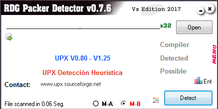

# Strings

After Decrypting the sample we look at the strings. We found a reference to **2004/01/xx** (might be used by the malware to start its execution). Another interesting string that we found was "**notepad %s**" which gives us an indication  that the malware might use the notepad.exe application while execution.

There are lots of strings which look to be encrypted and will be decrypted dynamically using some algorithm.

# Imports

There are calls to **RegOpenKeyExA**, **RegSetValue**, **RegQueryValueExA** and **RegCloseKey** thus indicating that windows registry files are accessed and maybe modified by the malware.  Calls to **GetModuleHandle**, **CreateFile**, **WriteFile** and **DeleteFile** are used to create a file, write values in a file and delete files. Thus indicating that some files might be created or deleted by the malware.

Calls to **CreateProcess**, **GetProcessAddress** and **CreateThread** are used to create a process and execute threads, this indicates that the malware might create a process or an executable during runtime and run it by creating a thread.

Calls to **GetSystimeAsFileName** and **GetSystimetoFileTime** are used to get the time that has passed since the starting of the system.

# Decryption Algorithm

After going through the entire algorithm which is used to decrypt the strings we found out that it is **ROT13**. It is a special case of Caesar Cipher. Now that we know the algorithm used to decrypt the strings we can better understand the working of the malware.

# Registry Access And Modifications

### Current Version
The sample opens "**Software\\Microsoft\\Windows\\CurrentVersion\\Explorer\\ComDlg32\\Version**" and checks if this registry exist if it does not then it creates it using **RegCreateKeyExA**.

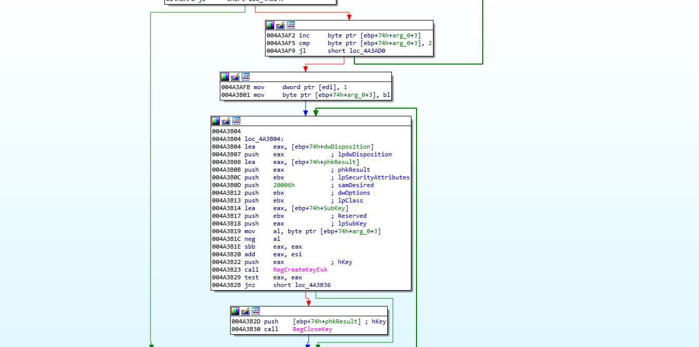

### WAB4
The malware also accesses the registry "**Software\\Microsoft\\WAB\\WAB4\\Wab File Name**", The Windows Address Book is an application that has a local database and user interface for finding and editing information about people. It can store comprehensive contact information in tabs including personal and business information.

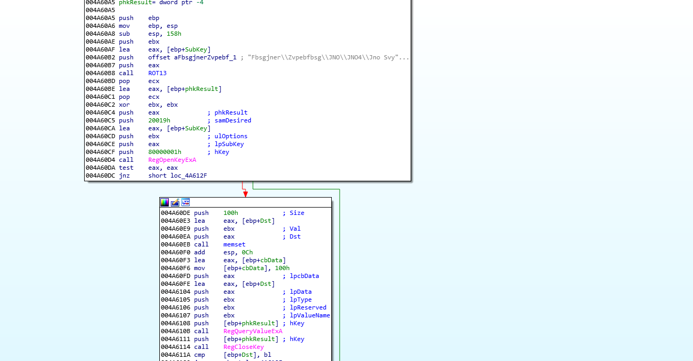

# Creating Mutex:
The malware Creates mutex named **SwebSipcSmtxS0Mutes**, most probably this is created so that only one instance of the malware can access the resources and runs at a time.

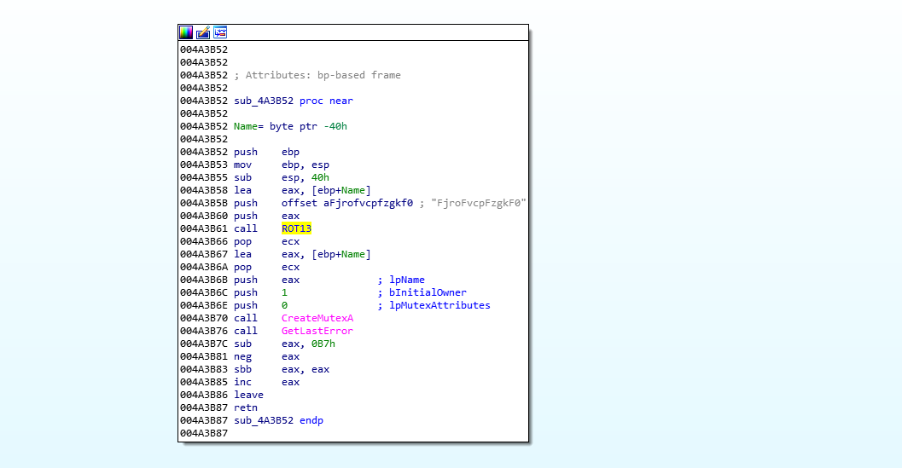

# Notepad.exe

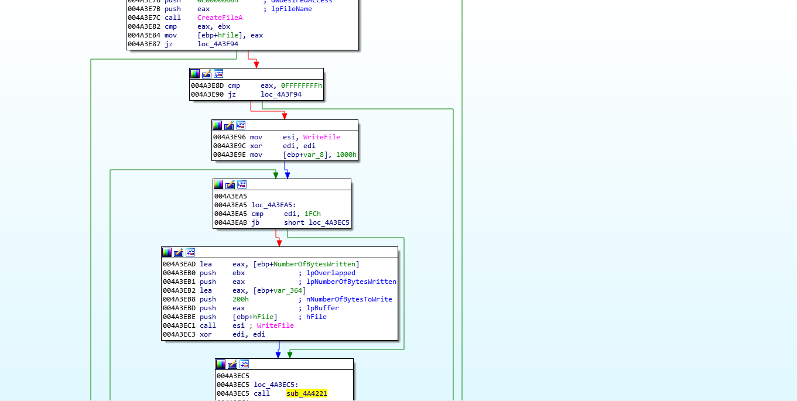

The malware creates a new thread which it is used to create a file having name "**Message**" and writes some garbage values in that file and opens that file in notepad. Thus giving an impression to the user that this is some garbage or corrupted file.

# Checking For Active internet Connection

The malware uses **GetInternetConnectionState** MSDN function to check whether the host machine has active LAN connection before executing its main functionality.

# Denial Of Service Attack:

After checking for active internet connection the malware decodes the domain name (**www.sco.com**).

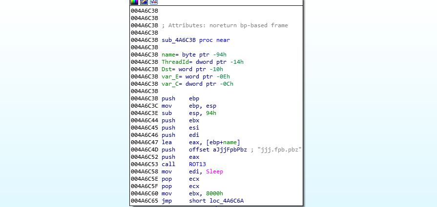

After Decoding the domain name the malware keeps on sending request to www.sco.com, until the system time reaches **Feb 12th, 2004** . Thus performing a denial of service attack(DOS).

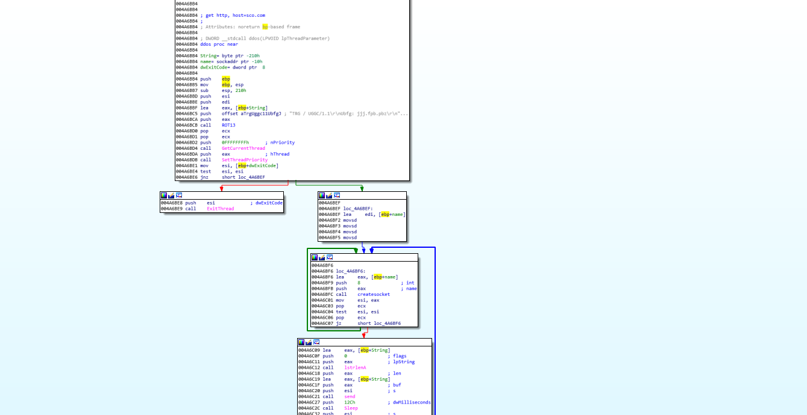

# File Creation:

### Shimgapi.dll
Malware creates a dynamically linked library(DLL) at "**C:\Windows\system32\shimgapi.dll**"

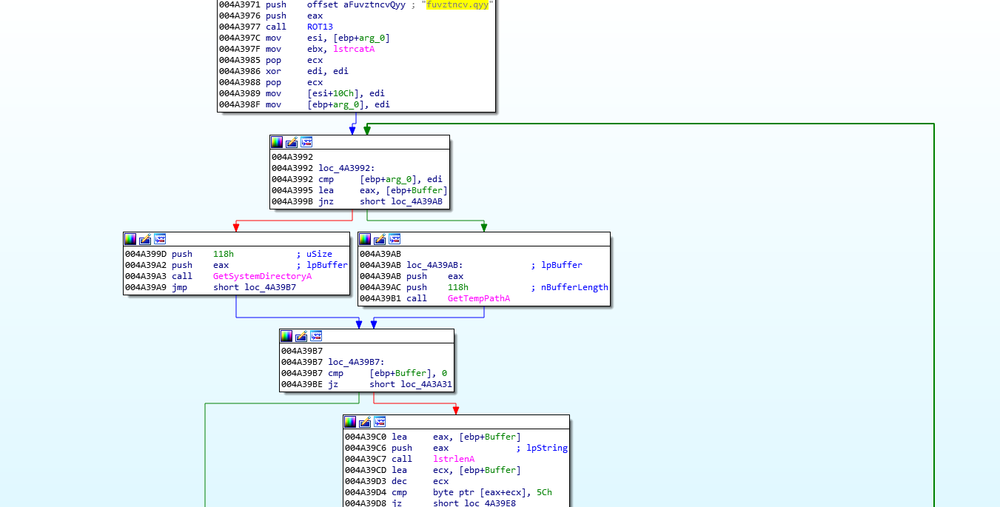

After going through the code of shimgapi.dll we found out that it is a RAT which opens a backdoor in the system so that the author can send instructions or other files to the effected system.

### Taskmon.exe
Malware also creates an executable having name 'Taskmon.exe' at "**C:\Windows\system32\Taskmon.exe**"

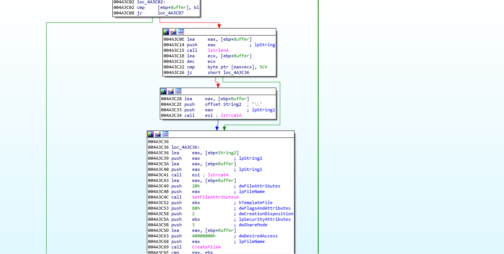

After analyzing Taskmon.exe we found out that it is nothing but the copy of mydoom malware.

### Kazaa

The malware also creates another copy of itself and saves it at "**Software\\Kazaa\\Transfer\\**".

having one of the following names:

The file will have one of the following extensions:

# Spreading Mechanism

Malware accesses "**Software\\Microsoft\\WAB\\WAB4\\Wab File Name**" to get stored email addresses it also accesses "**%USERPROFILE%\\ Temporary Internet Files \\ Local Settings**" for the same purpose.
the malware searches filenames with the following extensions which might have email ID's stored in them:

The malware forms usernames with a set of hardcoded strings in the executable.

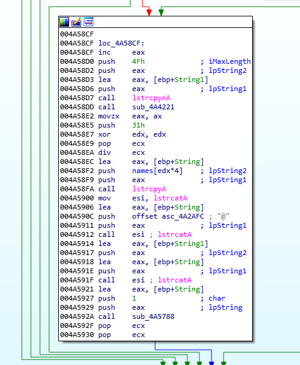

The names that the malware uses are as follows:

It avoids the following strings in its username:

The malware also avoids few strings in its domain name.

The malware forms email by writing date, senders address, subject, recipients address and body.

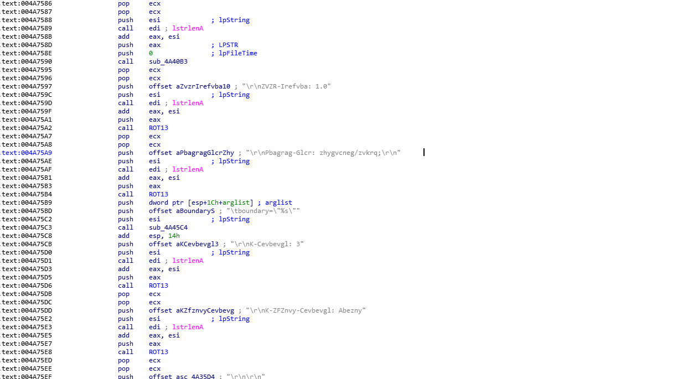

 For that the malware takes the system time and converts it to general conventions.

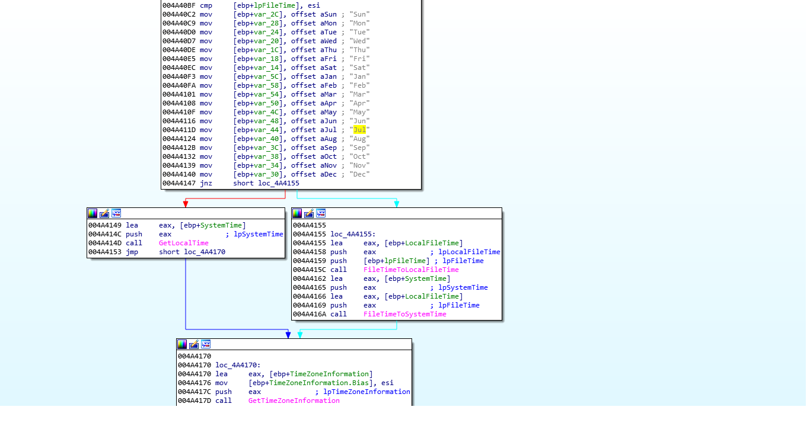

Finally the malware attaches its copy as an attachment and sends it to the **SMPT** servers using **TCP** protocol.

# Summary:

We found out this malware is actually a worm, when executed it opens **notepad.exe** and prints some random junk giving an impression of a corrupted file but behind the hood it performs **Denial of Service Attack** against **www.sco.com** and uses the date stamp to perform the attack(Attack happens if the system time lies between 1st Feb 2004 and Feb 12th, 2004). The malware creates **shimgapi.dll** which creates a backdoor in victim's machine, injects itself to Explorer and enables the author to send more executables if needed. The malware also creates 2 copies of itself and stores it in different location at the victim's machine.  it searches multiple directories for the stored email addresses and forms random subjects and body which are stored as strings in the malware itself. Finally the malware attaches itself as an attachment to the email. The malware uses **TCP** protocol to spread itself using **SMTP** servers.
