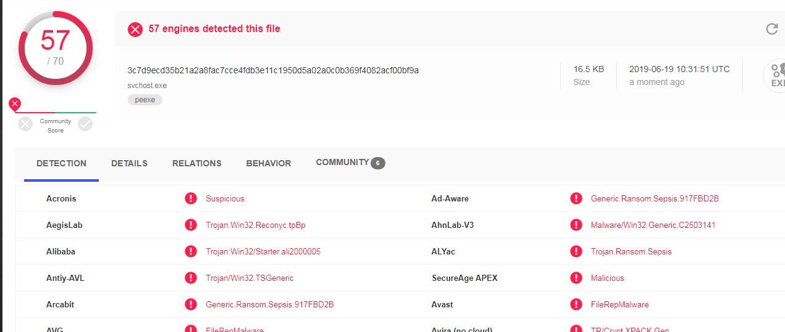

# Basic Information

|**Name:**|Sepsis Ransomware|
|:-:|:-:|
|**SHA256:**|**3c7d9ecd35b21a2a8fac7cce4fdb3e11c1950d5a02a0c0b369f4082acf00bf9a**|
|**SHA-1**|**518d5a0a8025147b9e29821bccdaf3b42c0d01db**|
|**MD5**|**1221ac9d607af73c65fd6c62bec3d249**|
|**File Type**|**Win32 EXE**|


# Detection:

According to the analysis report by Virus Total the detection rate of the sample is 57/70.



The malware is neither packed nor obfuscated.


# Analysis

## Strings:
There are couple a of strings that give us some important information about the functioning of this malware.

#### HTML code:
The ransom message displayed by the ransomware is stored in the form of HTML code in the strings section.

  

#### PublicKey:
  There is a hard coded public key inside the string section, which might be used by this malware to perform its encryption routine.

  

## Imports:
  There are calls to **"RegCreateKey"**, **"RegOpenKey"** and **"RegsetvalueExW"**, which are used for creating, opening and modifying windows registry keys respectively.
  There is also a call to **"CryptEncrypt"** which is the standard Windows API for encrypting data.

  

  Calls to **"CreateFile"**, **"DeleteFile"** and **"MoveFile"** are used for File Handling operations.

  

  There are CyptoAPI calls as well like **"CryptImportPublicKeyInfo"**, **"CryptStringToBinary"** and **"CryptDecodeObjectx"** which are imported from **Crypt32.dll**.

  

## GetAccessToken
Malware gets the handle of the current process and uses the **"OpenProcessToken"** and **"GetTokenInformation"** functions to check if the process is executing with administrative privileges and will exit if the functions are unable to retrieve the token.


## Creating Svchost.exe:
If the process has administrative privilages, it calls the **"GetWindowsDirectoryW"** function to get the location of the windows directory and stores a copy of itself by replacing itself with the original **"svchost.exe"**.


If the process does not have the administrative privileges then it finds the address of the temporary folder using the **"GetTempPathW"** function and stores a copy of itself as **"svchost.exe"**


**Svchost.exe** is the process which is used to manage the system services that run from Dynamically Linked Librares(DLL's)

## Modifying Registery Keys:

The malware first opens the registry key **"SOFTWARE\Microsoft\Windows NT\CurrentVersion\Winlogon"**, with edit access. As the name suggests, Winlogon is used for automatic login to a Windows System.

This feature may be a security risk. If you set a computer for auto auto autologon, anyone who can physically obtain access to the computer can gain access to all the computer's contents, including any networks it is connected to. Additionally, when autologon is turned on, the password is stored in the registry in plain text.The specific registry key that stores this value can be remotely read by the Authenticated Users group. This malware creates a key named **"Shell"** and sets its value as the path to svchost.exe


The malware creates and opens the registry key **"Software\\Classes\\mscfile\\shell\\open\\command"** and sets its value as the address of svchost.exe


## Eventvwe.exe:
The malware runs the **Eventvwe.exe** using the **"ShellExecuteW**.
Event viewer is a component of Microsoft's NT line of operating system's that lets the administrators and users view the event logs on a local or remote machine.


## Mutex:
Malware checks if the mutex "**HJG><JkFWYIguiohgt89573gujhuy78^*(&(^&^$**" exist, if the mutex already exists then **"ExitProcess"** is called otherwise the mutex with same name is created with all the access rights.


## Cmd Command Execution:

Malaware executes the following command in **cmd.exe** using **"ShellExecute"** API.

```
/c vssadmin.exe delete shadows /all /quiet & bcdedit.exe /set {default} recoveryenabled no & bcdedit.exe /set {default} bootstatuspolicy ignoreallfailures
```


- The **"/c vssadmin.exe delete shadows /all"** command is used to delete all the specified volumes of shadow copies and **"/quiet"** specifies that the command will not display messages while running. Shadow Copy is used to create backup copies or snapshots of computer files or volumes.

- The **"bcdedit.exe /set {default} recoveryenabled no & bcdedit.exe /set {default} bootstatuspolicy ignoreallfailures"** command is used to disable the automatic windows recovery and to ignore failures while booting. So basically this command is used so that the windows does not go to the diagnose mode in case of booting error.

## Forming Key & IV:
Looking at the key forming function that the malware first forms 2 string buffers of 32bytes and 16bytes respectively using a function which uses **"rand"** function calls to form string.


the code of this function is similar to the below code:

```c
char createString(int *addr, int size)
{
  char constantArray[53] = "abcdefghijklmnopqrstuvwxyzABCDEFGHIJKLMNOPQRSTUVWXYZ!";
  char \*finalbuffer, ch = '';
  int seed = 34;
  v4 = rand();
  srand(&seed + v4 % 0xC6aea155);
  finalbuffer = (char \*) malloc(size);
  int counter = 0, temp = 0 ;

  if(size != 0)
  {  
    do
    {
      temp = rand() % 100;
      if(temp <= 0x32)
      {
        if(counter < 0x1D)
        {
          temp = rand() % 0x12;
          ch = constantArray[temp + 52];
        }
        else
        {
          temp = rand() % 0x1A;
          ch = constantArray[temp + 26];
        }
      }
      else
      {
        temp = rand() % 0x1A;
        ch = constantArray[temp];
      }
      \*(finalbuffer + counter) = ch;
      counter = counter + 1;
    }while(counter < size)

  }
  return finalbuffer;
}
```
As we can see in the above code, rather than taking the seed variable value, the address of seed variable is taken as argument for **srand** function.


The 32byte string is used as the key and 16byte string as IV by the ransomware for performing encryption. IV is concatenated with the key using **memcpy**.


**"CryptStringToBinaryA"** function converts the hard-coded public key from PEM format to DER format, Unlike PEM format a DER file should not have any BEGIN/END.


 **string.CryptDecodeObjectEx**, is used to convert DER file to **CERT_PUBLIC_KEY_INFO**,
**"CryptAcquireContext"** and **"CryptImportPublicKeyInfo"** are used for acquiring the context and extracting the public key from that context respectively.
**"CryptEncrypt"** is used to perform public key encryption of the 48byte buffer(which has key + iv)


Finally base64 encoded string of the CryptEncrypted string is stored in buffer, Which is appended at the end of all the encrypted files.


## Create Thread:

A new thread is created, it is a recursive function which is used to find the path of files to be encrypted.


The thread uses **"PathCombineW"** command to concatenate the path and checks if the next file is a directory or not.

If the path is that of a directory then the recursive function is called again.


If path is that of a file then the malware fist checks if the file is valid using **CreateFile** function and if the file exist its size is calculated and FileMapping of that file is done using **"CreateFileMapping"** function having read and write access.

## Encryption:
Malware uses AES encryption to encrypt the files. The key and iv are passed as values which were originally created using the **createString** function explained above.


The key that was created had a size of 32bytes but the malware uses only first 16 bytes of the key.


Number of rounds of that each block goes through is also 10 thus AES 128bit CBC encryption is performed by this ransomware to encrypt the files.

## Critical Process

Address of the **NtSetInformationProcess** API is obtained using the **"getProcessAddress"** function with address of ntdll.dll as first argument and **NtSetInformationProcess** as second argument. Address of ntdll.dll is obtained using the **LoadLibrary** function. The ntdll.dll is used to export windows's native API.


The malware uses the **"NtsetInformationProcess"** to make the current process as a critical process.

## Ransom Message


HTML code is stored as a string buffer which is embedded in the malware, the code is dumped in a file using fwrite and then executed using the **"ShellExecuteW"** API.


The ransom message informs the user that all their files have been encrypted and in order to decrypt the files user has to send a mail at **sepsis@protonmail.com** with the provided ID as the title.

According to the ransom message, user will get a reply from malware author regarding the amount that needs to be paid to decrypt all the files. The Ransom amount must be paid in the form of BitCoins.

# Summary
The Ransomware first checks the privileges with which it is executing and based on that it either copies itself to windows directory or temp directory. Once copied, it changes multiple registry keys to gain access of the system using the the windows autologon feature.

The malware creates a 32byte key and a 16byte iv using a function which uses random numbers to create the strings, both key and iv are concatenated and encrypted using a public key winch is hard-coded in the binary, it then takes a base64 encode of the resultant encoded key and stores it in a buffer.

The malware uses AES-128 CBC mode to encrypt the files in the system using keys that it created from the createString(I defined its name as createString) function, it runs a recursive function to get the list of all files that it will encrypt.

After encryption a html page opens which informs user to pay the ransom in bit coins in order to decrypt the encrypted files and contains instructions to decrypt the files.

# References
- Winlogon: [https://support.microsoft.com/en-in/help/324737/how-to-turn-on-automatic-logon-in-windows](https://support.microsoft.com/en-in/help/324737/how-to-turn-on-automatic-logon-in-windows)

- CryptAPI: [https://stackoverflow.com/questions/1231178/load-an-x509-pem-file-into-windows-cryptoapi](https://stackoverflow.com/questions/1231178/load-an-x509-pem-file-into-windows-cryptoapi)

- WindowsAPI: [https://docs.microsoft.com/en-us/windows/desktop/apiindex/windows-api-list](https://docs.microsoft.com/en-us/windows/desktop/apiindex/windows-api-list)
